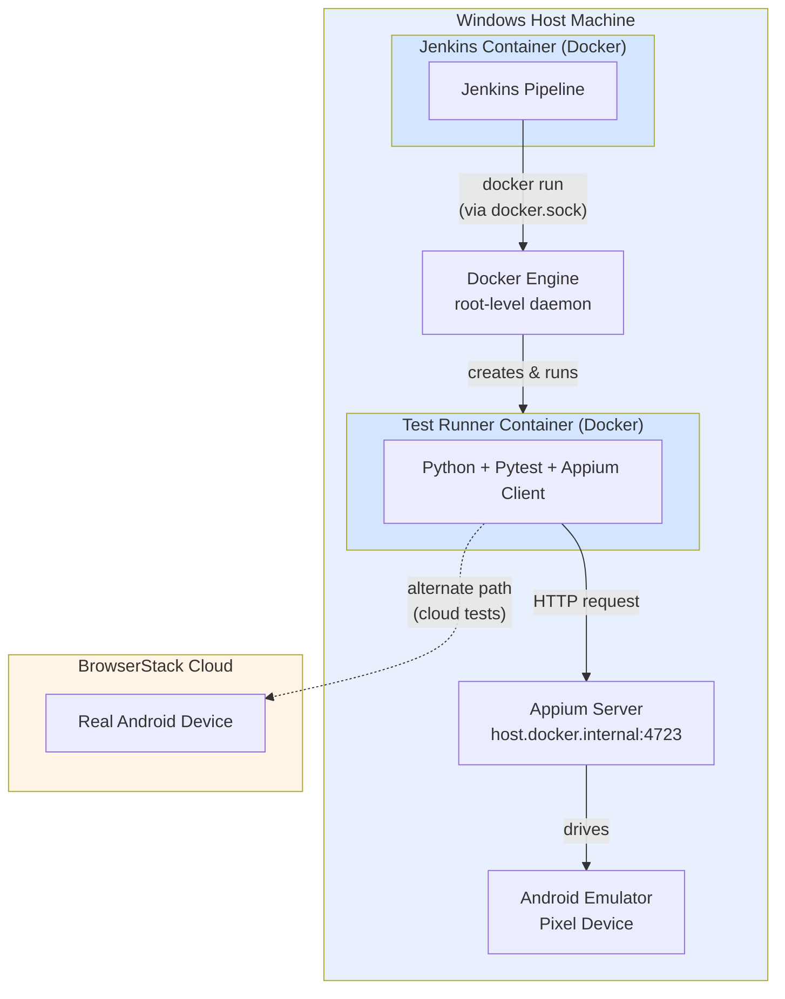

# 📱 Mobile Automation Appium Framework

[](/)
[](/)
[](/)
[](/)
[](/)
[](/)

A production-style native Android automation framework built with **Appium + Python + Pytest**, fully containerized with **Docker**, orchestrated through a **Jenkins CI/CD pipeline**, reported visually via **Allure**, and validated on **real cloud devices** through BrowserStack App Automate.

This project is part of a larger **Full Stack QA/SDET portfolio** covering UI automation, API automation, performance testing, database testing, and now — mobile automation.

---

## 📋 Table of Contents
- [Overview](#overview)
- [Architecture](#architecture)
- [Tech Stack](#tech-stack)
- [Features](#features)
- [Project Structure](#project-structure)
- [Setup Instructions](#setup-instructions)
- [Running Tests](#running-tests)
- [CI/CD Pipeline](#cicd-pipeline)
- [Real Device Testing (BrowserStack)](#real-device-testing-browserstack)
- [Reporting](#reporting)
- [Challenges & Engineering Decisions](#challenges--engineering-decisions)
- [Known Limitations](#known-limitations)
- [Future Improvements](#future-improvements)

---

## Overview

This framework automates the native Android **ApiDemos** sample application, covering:
- Element visibility and assertions
- Multi-screen navigation flows (forward + back navigation)
- Native Android scroll gestures (`UiScrollable`)
- Negative/edge-case scenarios (non-existent elements)
- Real device execution on BrowserStack cloud infrastructure

The goal of this project was not just to write Appium tests, but to build a **complete, CI/CD-integrated mobile automation pipeline** that mirrors how real QA/SDET teams operate — from a developer's local machine, through containerization, through automated CI/CD, to real-device validation.

---

## Architecture

### Local Development Setup (Windows)



### Why This Architecture

The Appium server and Android emulator run **directly on the Windows host**, not inside a container. This is a deliberate engineering decision, not an oversight:

- Android emulation requires **KVM hardware virtualization**, which is reliably available on Linux hosts but not on Windows/Mac Docker Desktop.
- The **test runner** (Python + Pytest + Appium client) is fully containerized and communicates with the host-based Appium server via Docker's `host.docker.internal` networking bridge.
- Jenkins itself runs as a Docker container and controls the **host's Docker engine** through a mounted `docker.sock` (Docker-outside-of-Docker / DooD pattern) — meaning Jenkins doesn't run a nested Docker engine; it issues build/run commands directly to the host engine.

**In a Linux-based CI environment** (e.g., a dedicated Jenkins agent on Linux), this same pipeline would run with the **emulator also fully containerized** (e.g., via `budtmo/docker-android`), since KVM is natively available there. This project is architected so that transition would only require swapping the emulator's location — the test code, Page Objects, and pipeline logic remain unchanged.

---

## Tech Stack

| Layer | Technology | Purpose |
|---|---|---|
| Automation Core | Appium 2.x + UiAutomator2 | Native Android UI automation |
| Language | Python 3.11 | Test implementation |
| Test Runner | Pytest | Test execution & fixtures |
| Retry Handling | pytest-rerunfailures | Automatic retry on transient/flaky failures |
| Design Pattern | Page Object Model (POM) | Maintainable, reusable UI abstractions |
| Containerization | Docker | Isolated, reproducible test execution |
| CI/CD | Jenkins (Declarative Pipeline) | Automated build → test → report |
| Reporting | Allure Report | Visual, stakeholder-friendly test reports |
| Cloud Devices | BrowserStack App Automate | Real Android device validation |
| Version Control | Git + GitHub | Source control, webhook-triggered builds |

---

## Features

- ✅ **Page Object Model** — clean separation between test logic and UI locators
- ✅ **Explicit waits** throughout — no `time.sleep()` anywhere in the framework
- ✅ **Native scroll gestures** via Android's `UiScrollable` (not manual swipe coordinates)
- ✅ **Negative scenario testing** — validates the framework fails predictably on non-existent elements
- ✅ **Automatic retry mechanism** for known Appium cold-start session flakiness
- ✅ **Dockerized test execution** with environment-variable-driven configuration (no hardcoded paths)
- ✅ **Jenkins CI/CD pipeline** — auto-triggered on Git push, builds Docker image, runs tests, publishes Allure report
- ✅ **Real device testing** on BrowserStack, reusing the same Page Objects as local emulator tests
- ✅ **Secrets handled via environment variables** — no credentials committed to source control

---

## Project Structure

```
mobile-automation-appium-framework/
├── pages/                          # Page Object classes
│   ├── base_page.py                 # Common reusable actions (click, wait, scroll)
│   └── home_page.py                 # ApiDemos home screen locators + actions
├── tests/                          # Test suite
│   ├── test_home_screen.py
│   ├── test_navigation.py
│   ├── test_scroll.py
│   ├── test_negative_scenarios.py
│   └── test_browserstack_home_screen.py
├── utils/
│   ├── driver_factory.py            # Local/Docker Appium driver setup
│   └── browserstack_driver_factory.py  # BrowserStack remote driver setup
├── apps/                            # Sample APK (ApiDemos)
├── docker/                          # Reserved for future Linux CI configs (containerized emulator)
├── reports/                         # Allure results (generated, gitignored)
├── conftest.py                      # Pytest fixtures
├── pytest.ini                       # Pytest configuration
├── requirements.txt                 # Python dependencies
├── Dockerfile
├── docker-compose.yml
├── Jenkinsfile
└── README.md
```

---

## Setup Instructions

### Prerequisites
- Java JDK 17+
- Node.js + npm
- Android Studio (SDK + Emulator)
- Python 3.11+
- Docker Desktop

### 1. Clone & Environment Setup
```bash
git clone https://github.com/YashKushalvardhan/mobile-automation-appium-framework.git
cd mobile-automation-appium-framework
python -m venv venv
venv\Scripts\activate        # Windows
pip install -r requirements.txt
```

### 2. Appium Setup
```bash
npm install -g appium
appium driver install uiautomator2
```

### 3. Start Emulator
```bash
emulator -avd <your_avd_name>
adb devices     # confirm device is connected
```

### 4. Start Appium Server
```bash
appium --address 0.0.0.0 --port 4723
```

### 5. Run Tests Locally
```bash
pytest tests/ -v --alluredir=reports/allure-results
allure serve reports/allure-results
```

---

## Running Tests

| Method | Command |
|---|---|
| Direct local run | `pytest tests/ -v` |
| Dockerized run | `docker-compose up --build` |
| Jenkins CI/CD | Trigger via Git push or "Build Now" in Jenkins UI |
| Real device (BrowserStack) | `pytest tests/test_browserstack_home_screen.py -v` |

---

## CI/CD Pipeline

The Jenkins pipeline (see `Jenkinsfile`) performs the following stages on every push to `main`:

1. **Checkout** — pulls latest code from GitHub
2. **Build Docker Image** — builds the test runner image
3. **Run Tests** — runs the container against the host-based Appium server + emulator, with automatic retries for known flaky sessions
4. **Publish Allure Report** — copies results out of the container (via `docker cp`, to correctly handle the Jenkins-in-Docker path context) and publishes a visual report inside Jenkins

Jenkins itself runs as a Docker container using the **Docker-outside-of-Docker (DooD)** pattern — it controls the host's Docker engine via a mounted `docker.sock`, rather than running a nested Docker daemon.

---

## Real Device Testing (BrowserStack)

In addition to the local emulator setup, this framework validates the same test logic on a **real Android device** via BrowserStack App Automate:

- The APK is uploaded to BrowserStack via their REST API / App Management dashboard
- A separate `BrowserStackDriverFactory` handles the remote WebDriver session, using BrowserStack's Appium hub
- **The same Page Objects (`HomePage`, `BasePage`) are reused without modification** — proving the framework's abstraction is portable across execution environments (local emulator vs. real cloud device)
- Credentials (`BROWSERSTACK_USERNAME`, `BROWSERSTACK_ACCESS_KEY`) are read from environment variables, never hardcoded
- Every run is visible on the BrowserStack dashboard with full video playback, device logs, and network logs

---

## Reporting

Test results are captured via **Allure**, providing:
- Pass/fail statistics and trends
- Per-test execution timeline and duration
- Full stack traces for failures
- A visual report accessible both locally (`allure serve`) and inside Jenkins (via the Allure Jenkins Plugin)

---

## Challenges & Engineering Decisions

Building this framework surfaced several real-world engineering problems — documented here deliberately, since working through them (rather than avoiding them) is the actual value of the project.

### 1. Module Import Errors (`ModuleNotFoundError`)
Running `pytest` from different directories caused `pages`/`utils` imports to fail. **Fixed** by adding `pythonpath = .` to `pytest.ini`, making imports consistent regardless of invocation location.

### 2. Missing Appium Driver
Initial test runs failed with `Could not find a driver for automationName 'UiAutomator2'`. The Appium **server** and the **UiAutomator2 driver** are separate installations — the server alone cannot drive a device. Fixed via `appium driver install uiautomator2`.

### 3. Non-Unique Locators
Inspecting the app's UI showed that all list items shared the same `resource-id` (`android:id/text1`), making it unusable as a unique locator. Switched to **Accessibility ID** (`content-desc`), which was unique per item — a reminder that locator *uniqueness* matters more than locator *availability*.

### 4. Docker Networking Across Host/Container Boundaries
Since the emulator and Appium server run on the Windows host (outside Docker) while tests run inside a container, both the **Appium server URL** and the **APK file path** had to be resolved from the *Appium server's* perspective (the Windows host), not the container's. This was solved by making both values configurable via environment variables (`APPIUM_SERVER_URL`, `APK_PATH`) rather than hardcoding container-relative paths.

### 5. Docker-outside-of-Docker (DooD) Permission Errors
Running Docker commands from inside the Jenkins container initially failed with `permission denied` on `/var/run/docker.sock`, since the `jenkins` user lacked access to the mounted socket. Resolved by adding the `jenkins` user to the socket's owning group inside the container.

### 6. Allure Results Not Appearing in Jenkins
Even after tests passed in Jenkins, the Allure report showed zero results. Root cause: a **volume mount path mismatch** — `$WORKSPACE` resolves to a path *inside the Jenkins container*, which doesn't exist on the host's Docker daemon filesystem (since Jenkins itself is containerized and Docker commands are executed by the host engine via DooD). Mounting that path caused Docker to silently create a disconnected, empty folder. **Fixed** by replacing the volume mount with `docker cp`, which resolves paths from the Jenkins container's own filesystem instead of relying on host-daemon path assumptions.

### 7. Emulator "Cold-Start" Session Flakiness
The very first Appium session in a run occasionally failed with `InvalidSessionIdException`, while all subsequent sessions passed reliably. This is a known Appium/UiAutomator2 behavior — the first session involves installing Appium's internal automation-enabling server onto the device, which can be slow or unstable on a freshly booted emulator. Rather than masking this, it was addressed directly with `pytest-rerunfailures`, so transient failures are automatically retried while genuine bugs still surface clearly.

### 8. Resource Contention Under Jenkins
Running Docker + Jenkins + the emulator simultaneously on a single Windows machine occasionally introduced timing-related flakiness not seen in isolated local runs. This reflects a genuine constraint of local development hardware rather than a framework defect, and is mitigated by increased explicit wait tolerances and the retry mechanism above.

---

## Known Limitations

- **Emulator is not containerized** in this Windows-based setup, due to the unavailability of reliable KVM virtualization on Windows Docker Desktop. On a Linux CI agent, the emulator would be fully containerized alongside the rest of the stack.
- **Jenkins runs locally** on the same machine as the emulator, rather than on a dedicated CI server — this is a deliberate scope decision for a portfolio/learning project, not a production topology.
- **BrowserStack integration currently covers a subset of tests**; expanding full suite coverage to real devices is a natural next step.

---

## Future Improvements

- Extend BrowserStack coverage to the full test suite, and add a dedicated Jenkins stage for cloud-device runs
- Add data-driven/parameterized tests
- Add parallel execution across multiple emulators/devices (`pytest-xdist`)
- Fully containerize the emulator stack for a Linux CI agent, demonstrating the production-equivalent architecture referenced above

---

## Author

**Yash Kushalvardhan**
SDET / QA Automation Engineer — Dublin, Ireland
[LinkedIn](https://www.linkedin.com/in/yash-mohan-kushalvardhan-65674119a) | [GitHub](https://github.com/YashKushalvardhan)

Part of a broader Full Stack QA/SDET portfolio spanning UI automation (Playwright), API automation (Pytest), performance testing (JMeter), database testing (PostgreSQL), and mobile automation (Appium).
